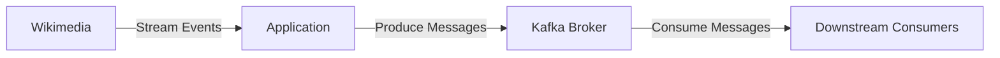

# Wikimedia With Kafka - Advanced Configurations

This project demonstrates how to integrate Wikimedia data streams with Apache Kafka using advanced configurations. It serves as a robust template for real-time data ingestion pipelines, focusing on optimized Kafka producer and consumer settings, reliability, scalability, and maintainability.

## Table of Contents

- [Project Overview](#project-overview)
- [Features](#features)
- [Architecture](#architecture)
- [Prerequisites](#prerequisites)
- [Getting Started](#getting-started)
- [Kafka Advanced Configurations](#kafka-advanced-configurations)
- [Usage](#usage)
- [Troubleshooting](#troubleshooting)
- [Contributing](#contributing)
- [License](#license)

## Project Overview

The main goal of this project is to fetch real-time change events from Wikimedia and publish them into Kafka topics. It leverages advanced Kafka configurations to ensure high-throughput, fault tolerance, and efficient resource usage. This setup is ideal for learning, prototyping, or as the foundation for production-ready data streaming pipelines.

## Features

- **Real-time Wikimedia integration**: Consumes live change events from Wikimedia.
- **Robust Kafka Producer/Consumer**: Uses advanced configurations for reliability and performance.
- **Scalable architecture**: Easily adapt to increased data volumes.
- **Error Handling & Retry Logic**: Minimizes data loss and maximizes uptime.
- **Configurable parameters**: Easily adjust Kafka topic, partition, and broker settings.

## Architecture



- **Wikimedia**: Source of real-time event data.
- **Application**: Fetches events and pushes them to Kafka.
- **Kafka Broker**: Handles message queuing and distribution.
- **Downstream Consumers**: Applications or services that process the data.

## Prerequisites

- [Java 8+](https://adoptopenjdk.net/)
- [Apache Kafka](https://kafka.apache.org/) (local or cloud instance)
- [Docker](https://www.docker.com/) (optional, for local Kafka setup)
- [Git](https://git-scm.com/)

## Getting Started

1. **Clone the repository**
   ```bash
   git clone https://github.com/juliocesarcs2004/Wikimedia-With-Kafka-Advanced-Configurations.git
   cd Wikimedia-With-Kafka-Advanced-Configurations
   ```

2. **Start Kafka (locally, if needed)**
   - Using Docker Compose:
     ```bash
     docker-compose up -d
     ```

3. **Configure application settings**
   - Edit the configuration file (e.g., `application.properties` or `.env`) to set Kafka broker address, topic name, and other parameters.

4. **Build and run the application with Gradle**
   - To build the project:
     ```bash
     ./gradlew build
     ```
   - To run the project:
     ```bash
     ./gradlew bootRun
     ```

## Kafka Advanced Configurations

This project uses advanced producer and consumer settings to optimize for performance and reliability:

### Producer Settings

- `acks=all`: Ensures full commit of messages.
- `retries=3`: Retries sending messages if failures occur.
- `linger.ms=5`: Batches messages for higher throughput.
- `batch.size=16384`: Controls the batch size for messages.
- `compression.type=snappy`: Compresses messages for network efficiency.

### Consumer Settings

- `enable.auto.commit=false`: Manual offset management.
- `max.poll.records=500`: Controls the number of records per poll.
- `auto.offset.reset=latest`: Only reads new messages.
- `session.timeout.ms=30000`: Adjusts session timeout for consumer group.

> **Note**: Configuration options may vary depending on the programming language and Kafka client library.

## Usage

- The application connects to Wikimedia’s event stream endpoint and publishes events to the specified Kafka topic.
- Downstream consumers can subscribe to the Kafka topic to process data in real time.

## Troubleshooting

- **Kafka connection errors**: Ensure that the broker address is correct and the Kafka service is running.
- **Wikimedia API changes**: Check the official [Wikimedia EventStreams documentation](https://wikitech.wikimedia.org/wiki/EventStreams) for updates.
- **Performance issues**: Tune the Kafka producer/consumer settings as needed.

## Contributing

Contributions are welcome! Please open issues or submit pull requests for improvements, new features, or bug fixes.

## License

This project is licensed under the MIT License.

---

**Author:** [juliocesarcs2004](https://github.com/juliocesarcs2004)
